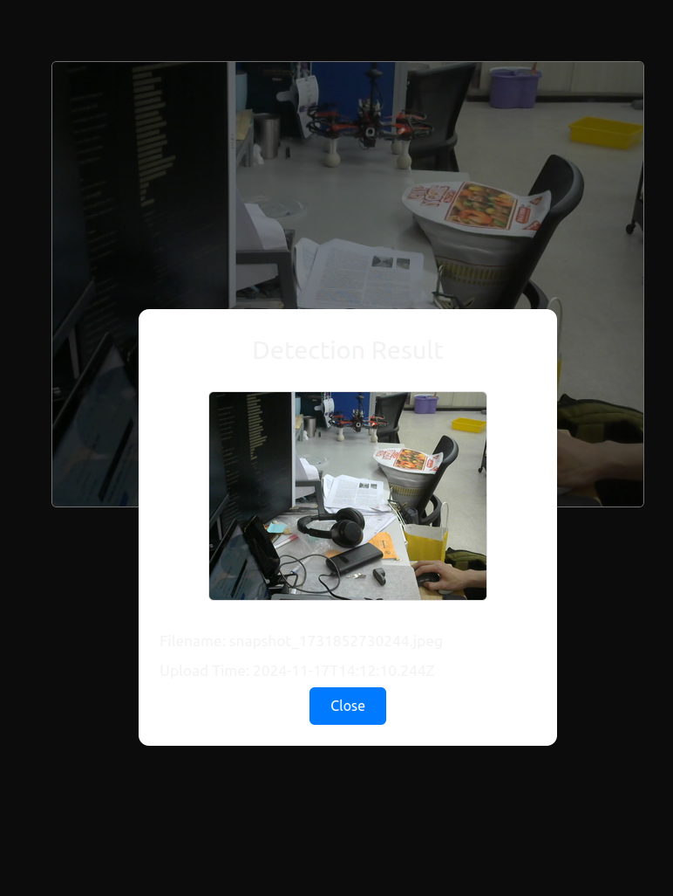
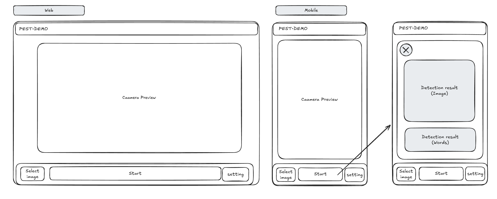

# I2PDM2-vuejs-frontend

- 11-13:
  - Create docker-compose.yaml for frontend for development
  - Change the cmaera open method
  - test with localhot, not yet on mobile because unsecure connection can not require camera permission (need https)
- 11-14:
  - Add uplaod button and setting button(setting button is usless now)
  - add box overlay
  - after pressing camera button -> flip the image to pretend the result
- 11-17:
  - Toggle camera
  - show popup dialog

port from pest-webapp

---

## UI target

